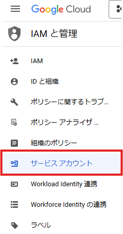
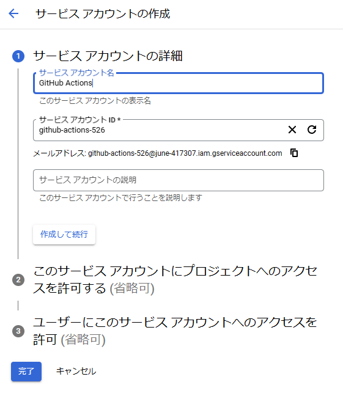
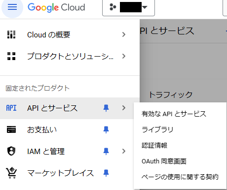
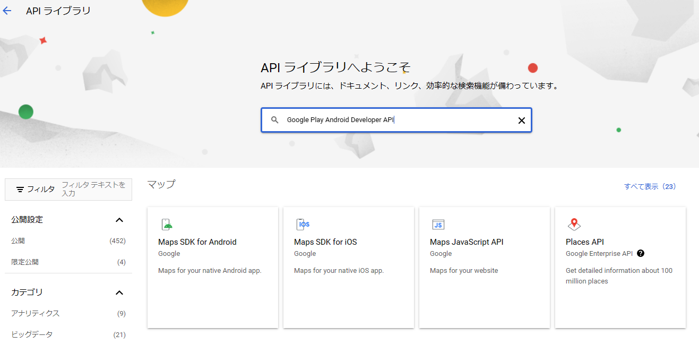
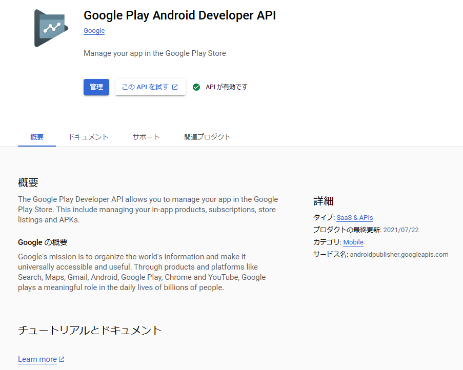
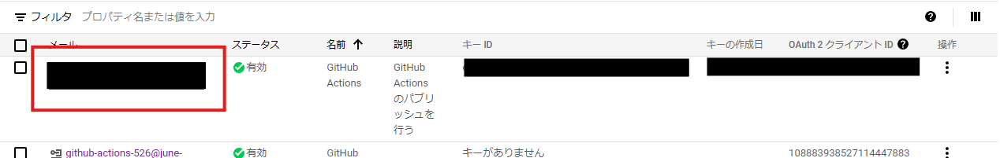
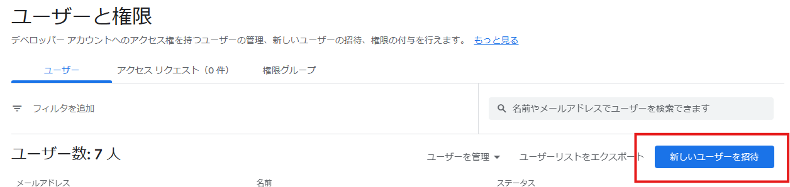
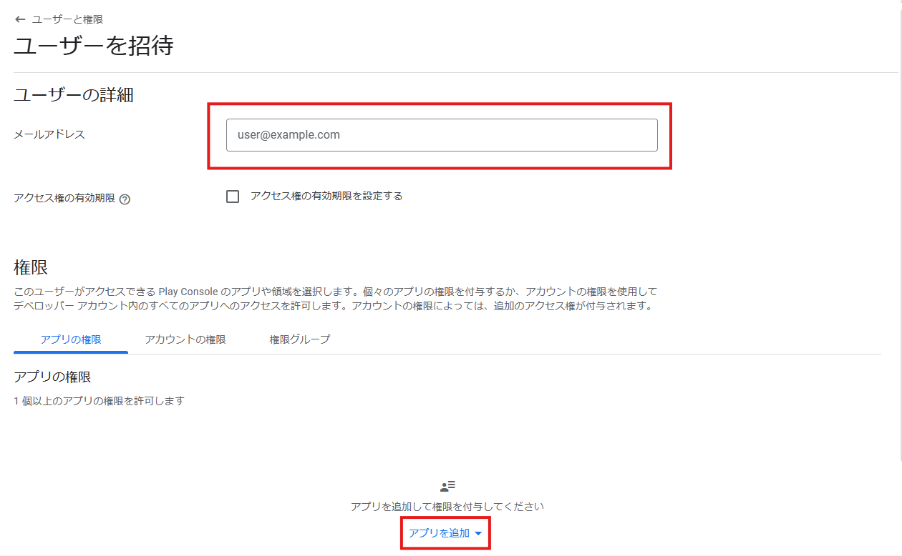

# publish-googleplay-github-action

## Usage

```yaml
- name: 📤 Publish to Google Play Console
  uses: akiojin/publish-googleplay-github-action@v0.1.2
  with:
    aab-path: <aab path>
    package-name: <package name>
    service-account-key: ${{ secrets.GOOGLE_SERVICE_ACCOUNT_KEY }}
    track: internal
```

## Google Cloud Service Account

To use this action, you must create a service account in Google Cloud and register the created service account in the Google Play Console.

In Google Cloud, click on the service account.



Click on "Create Service Account" at the top.


The service account detail settings screen will open. Set the service account to "GitHub Actions". This name can be arbitrary.



Next, click on "APIs and Services" from the burger menu in the upper left corner.



Search for "Google Play Android Developer API" in the API library search.



Click "Enable API" on the Google Play Android Developer API details screen.



Copy the email address of the service account created.



Go to Google Play Console and click on "Users and Permissions".


On the Users and Permissions screen, click on "Invite New Users".



Paste the email address of the service account you just copied and select the application you wish to authorize.

